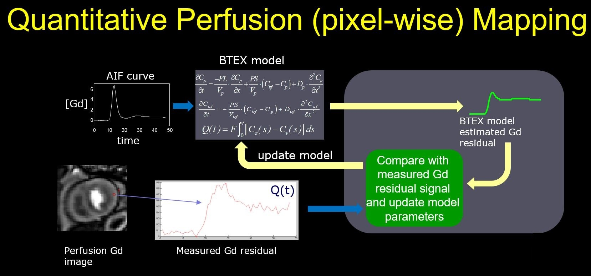

# QPerf: Automatic In-line Quantitative Myocardial Perfusion Mapping

Quantitative perfusion (QPerf) is an emerging technique to directly measure blood supply to the myocardial mussel. It is demonstrating potential to be a valid clinical tool for ischemia and many non-ischemic cardiac disease. 

This repo contains the cardiac flow mapping tool we developed, in supplement to our paper submitted to [Magnetic Resonance in Medicine](https://onlinelibrary.wiley.com/journal/15222594), titled "Automatic In-line Quantitative Myocardial Perfusion Mapping: processing algorithm and implementation". This paper is currently under review.

The Blood-tissue-exchange model (BTEX [1](by Prof. James Bassingthwaighte, https://www.physiome.org/)) is used in this study for quantitative perfusion. For fully disclosure, there are many different models proposed in past two decades [2](https://www.ncbi.nlm.nih.gov/pubmed/22173205). 

BTEX model (20 version) solves two partial differential equations for myocardial blood flow (MBF, ml/min/g), permeability-surface-area product (PS, ml/min/g), blood volume (V_b, ml/g) and interstitial volume (V_isf, ml/g).



To perform perfusion fitting, two inputs are needed: Cin and y. Cin is the input function for myocardium (e.g. arterial input function, AIF, measured from dual-sequence perfusion imaging) and y is the myocardial signal. Both Cin and y should be converted to Gd concentration unit (mmol/L) or have the same scale to the Gd concentration. Otherwise, the estimated flow will be off by a scaling factor.

The QPerf mapping is provided as a function call:

```
gadgetron_QPerf_mapping -h
Allowed options:
  -h [ --help ]                         Produce HELP message
  -f [ --cin_file ] arg (=cin_file)     <AIF signal, [N 1]>
  -i [ --y_file ] arg (=perf_file)      <input perfusion Gd images, [RO E1 N]>
  -m [ --fmap_file ] arg (=MBF)         <output flow map, [RO E1]>
  --foot arg (=0)                       <foot for aif signal>
  --peak arg (=0)                       <peal for aif signal>
  --dt arg (=500)                       <sampling interval in ms, e.g. 500ms>
  --hematocrit arg (=0.41999999999999998)
                                        <hematocrit, default 0.42>
```
This function will compute BTEX look-up-table (LUT) and perform pixel-wise mapping.

The **examples** folder has running example file to demonstrate the usage of these commands.

To install the software, clone this repo and add **%BASE_DIR%/QPerf/software** to your path, suppose the repo was cloned to **%BASE_DIR**.

Current version of software was tested in windows 10.

An example of perfusion AIF and imaging data are provided in the examples folder. 

<p align="center">
  
</p>

<p align="center">
  
</p>

For more comments and suggestions, please contact me at :

```
Hui Xue
National Heart Lung and Blood Institute (NHLBI)
National Institutes of Health
10 Center Drive, MSC-1061
Bethesda, MD 20892-1061
USA

Email: hui.xue@nih.gov
```
